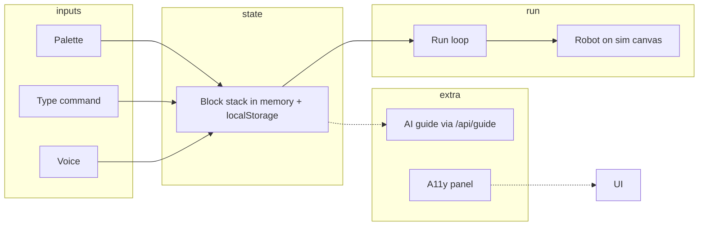

# BrailleEd playground — functionality and architecture

This document describes the **block-based robotics playground** at `/playground/`: what it does, how it is built, and how the main pieces fit together.

**SPIKE Prime upgrade (roadmap and agent brief):** see [`docs/spike-prime-playground-spec.md`](./spike-prime-playground-spec.md). The codebase now implements **Phase 1 foundations**: SPIKE-shaped command metadata, parameterised blocks, client MicroPython codegen (`src/lib/codegen.ts`), voice param hints (`src/lib/voice-params.ts`), and export JSON that includes a `python` field. Later phases (diff-drive sim, `.llsp3`, VM API) follow that document.

**3D robot model (GLTF):** the default scene file lives at `public/scene.gltf` and is available in the browser as **`/scene.gltf`**. The constant is `PLAYGROUND_SCENE_GLTF_URL` in `src/data/gltf-config.ts`. Use `inspectGLTF(PLAYGROUND_SCENE_GLTF_URL)` in `src/lib/gltf-inspector.ts` to list meshes, bones, animations, and suggested wheel/body bindings.

## Purpose and audience

The playground is a **voice-first, screen-reader–aware** editor where students stack “blocks” (robot commands), run them on a **2D robot simulator**, and optionally use an **AI mentor** (guided projects) that calls a backend model. It is aimed at blind and low-vision learners; feedback uses **speech synthesis**, **ARIA live regions**, and an **accessibility settings** panel shared with the landing site.

## Entry and routing

- **URL:** `/playground/` (Vite redirects bare `/playground` to `/playground/` so the directory index loads reliably.)
- **HTML entry:** `playground/index.html` loads `src/pages/playground.ts`.
- **Bootstrap:** That page runs `initA11yFromStorage()` then `mountPlayground()` on `#app`.

## High-level layout

The UI is injected by `getPlaygroundShellHtml()` in `src/components/playground/shell-html.ts` and has three main columns (responsive; narrow layouts may reflow per CSS):

| Region | ID / role | Role |
|--------|-----------|------|
| **Block palette** | `#playgroundPaletteCol` | Category icons + list of addable blocks; manual command field |
| **Script canvas** | `#scriptCanvas` | Vertical stack of blocks; Run-related toolbar (clear, undo, zoom) |
| **Stage** | `#playgroundStageCol` | Robot, transcript strip, stage controls, **Guided project** panel, run log |

The **top bar** includes: logo (home), project name, **A11y** (accessibility dialog), **Speak Command** (mic), **Run** / **Stop**, and a **connection / status** badge for voice.

The **footer** has **Export Program** and a short status line.

## Core modules (source files)

| Module | Responsibility |
|--------|-----------------|
| `src/components/playground/mount-playground.ts` | Main controller: DOM wiring, stack state, voice, simulation, persistence, export |
| `src/components/playground/shell-html.ts` | Static HTML string for the whole IDE shell |
| `src/components/playground/wire-ai-guide.ts` | Guided project UI, thread + enrollment storage, calls `requestGuide` |
| `src/components/playground/wire-playground-tour.ts` | First-run **tour** (`startPlaygroundTour`); shown on first visit unless `localStorage` marks it done |
| `src/components/playground/index.ts` | Re-exports `mountPlayground` and `getPlaygroundShellHtml` |
| `src/data/commands.ts` | SPIKE-oriented `CATEGORIES`, `COMMANDS` (params + `codegen`), `STORAGE_KEY`, legacy migration from `brailleEduMvpBlocksV1` |
| `src/lib/codegen.ts` | Block stack → MicroPython (`compileToMicroPython`) for export |
| `src/lib/voice-params.ts` | `extractParamsFromUtterance` for voice-added blocks |
| `src/lib/gltf-inspector.ts` | `inspectGLTF(url)` — scene graph + animations for `public/scene.gltf` (etc.) |
| `src/data/gltf-config.ts` | `PLAYGROUND_SCENE_GLTF_URL` = `"/scene.gltf"` |
| `src/data/guide-projects.ts` | `GUIDE_PROJECTS` — lesson metadata for the AI guide |
| `src/lib/utils.ts` | `findBestCommandIndex`, `normalizeText`, `sleep`, `clamp` |
| `src/lib/guide-client.ts` | `requestGuide()` → `POST /api/guide` |
| `src/lib/wire-a11y-panel.ts` | Mounts the **Accessibility settings** dialog (toggles from `a11y-toggles-meta` / `a11y-preferences`) |

## Data model

- A **command** (`Command` in `src/types/app.ts`) has: `id`, `phrase`, `aliases`, `label`, `category`, `icon`, `params[]` (typed parameters with defaults), `sim` (simulator behaviour + defaults), and `codegen` (`template`, `imports`, `isAsync`, `isBlock`) for MicroPython output.
- A **block** in the stack is `Block = { id: string; commandId: string; params: Record<string, string | number> }`.

## Block palette and categories

- **Categories** are defined in `CATEGORIES` (Motion, Sound, Lights, Control, **My Voice**). The palette filters `COMMANDS` by the selected category. **Note:** current `COMMANDS` in `commands.ts` do not use the `voice` category, so that tab may list zero blocks until commands are added there.
- Clicking a palette block **appends** one instance to the program and saves.

## Building a program: three input paths

1. **Palette** — click a block to add.
2. **Manual line** — `#manualCmd`: type a phrase and press **Enter**; same parsing as voice.
3. **Microphone** — **Speak Command** uses the Web Speech API (`SpeechRecognition` / `webkitSpeechRecognition`).

### Voice behavior

- **Browser support:** If recognition is missing, the UI shows a disconnected state and tells the user to use Chrome/Edge or the manual field.
- **Settings:** Continuous recognition, interim results, `lang: "en-US"`. Final segments are passed to `processCommand` (lowercased).
- **Session:** While listening, a **voice drop zone** hint is shown. Listening **auto-stops after 3 minutes** (`LISTEN_SESSION_MS`); the user can tap the mic again.
- **Restart on end:** `onend` restarts recognition while `isListening` is true, so the session stays open across pauses.
- **Matching:** `processCommand` normalizes text, splits on **and then / then / and / comma** to allow **chained** commands in one utterance, and uses `findBestCommandIndex` (longest matching phrase/alias wins whole-word style).

## Script canvas (stack)

- Blocks appear **top to bottom** under a “When Run is pressed” hat, matching **execution order**.
- **Undo** removes the last block; **Clear** empties the stack.
- **Per block:** move up/down buttons, remove, and **HTML5 drag-and-drop** reordering between nodes.
- **Zoom** scales `#stackWrap` (about 70%–140%) for readability; does not change program semantics.

**Persistence:** `saveBlocks` / `loadBlocks` use `localStorage` under key `brailleSpikeBlocksV1`. Older saves under `brailleEduMvpBlocksV1` are migrated once to the new schema.

## Run / simulation

- **Run** (header or stage) executes the stack sequentially with a short delay between blocks. While running, **Stop** sets an abort flag and ends the run; executing blocks get a visual “executing” class.
- **Initial state:** Robot position is reset to the centre of the stage; angle 0. Movement uses a simple **percentage coordinate** model (`robotX` / `robotY` from 0–100) with trigonometry for “forward”/“backward” along the current heading. **Turn** adds to `robotAngle` (e.g. ±90°, 360° spin).
- **Beep** uses a short **Web Audio** tone and **speech** announcements where applicable.
- **Blink** adds a temporary CSS class on the robot.
- A **trail** of fading dots is spawned during motion-related steps. The **sim log** lists lines like `Executing: …` and completion.
- **Narration:** `announcePolite` / `announceAssertive` set live regions and use `speechSynthesis` so feedback is spoken. Run start/finish use `speakAndWait` for important messages.

(Commands whose `sim.action` is `stop` are still in the list and advance the run loop; they do not currently add extra motion/sound beyond the standard step delay and log line.)

**Reset** — recentres the robot and heading without clearing blocks.

**Expand stage** — toggles a `stage-expanded` class on `.app-shell` for a larger stage on supported layouts.

## Transcript strip

- Shows the latest **voice** / **command result** status (e.g. recognised vs not). It resets to a default “Ready” line after a few seconds of inactivity.

## Export

- **Export Program** downloads `braillerobotics-spike-program.json`: `{ version: 2, createdAt, projectName, python, blocks }` including generated MicroPython for SPIKE 3–style APIs. Empty stack export is blocked with an announcement.

## AI guided project (Hugging Face / Gemma Space)

- UI lives in `#aiGuideRoot` in the shell.
- **Projects** come from `GUIDE_PROJECTS` in `src/data/guide-projects.ts` (e.g. “Walk a square”, “Dance with sound and light”, “Start, move, then stop”, “Open exploration”).
- **Enroll** saves enrollment to `localStorage` (`brailleGuideEnrollmentV1`), clears the **conversation thread**, and sends an **intro** user message so the model replies with a first step.
- **Thread** is stored as `brailleGuideThreadV1` (last 24 turns).
- **System instruction** (built in `wire-ai-guide.ts`) describes the mentor role, lists all blocks with phrases, and injects the selected project’s `summary` and `mentorBrief`.
- **“What should I do next?”** sends the current program title and a **text summary of the block stack** (order, labels, phrases).
- **Custom ask** appends the same stack summary plus the user’s question.
- **API:** `requestGuide` in `guide-client.ts` posts JSON to `/api/guide`; the Vite dev server proxies that to the configured Gradio Space (see `vite-guide-proxy` / env). **Timeout:** 25s with a **fallback** assistant message on abort.
- **Errors** show in `#guideError` and are also announced assertively; successful replies are announced politely.

## Accessibility (A11y) panel

- **Open** from `#a11yOpenBtn`. Implemented in `wire-a11y-panel.ts`: toggles are driven by `A11Y_TOGGLE_DEFS` and persisted with the same mechanism as the landing page (`a11y-preferences.ts`).

- **Note:** `mount-playground` passes `wireA11yPanel` a variant of announce that only updates the **polite** live region (to avoid double-speaking with the main `announcePolite` that also calls TTS for general UI). Core announcements still go through the main `announcePolite` / `announceAssertive` in the playground module.

## First-run tour (optional wiring)

- `wire-playground-tour.ts` implements a modal **step tour** (different steps for viewports &lt; 768px), highlights targets, sets `#app`’s shell to `inert` while open, and stores completion in `localStorage` key `braillePlaygroundTourDoneV1`.
- Exports: `isPlaygroundTourComplete()`, `startPlaygroundTour({ appRoot, srPolite, onClose })`, `markPlaygroundTourNotDone()`.
- As of the current `src/pages/playground.ts`, the tour is **not started automatically**; it is available to wire (e.g. after mount) if you want a guided onboarding.

## Key constants and files to change

| If you want to… | Look at… |
|-----------------|----------|
| Add/rename blocks or phrases | `src/data/commands.ts` + `src/types/app.ts` |
| Change saved program key or schema | `STORAGE_KEY` and `loadBlocks` in `mount-playground.ts` |
| New guided lessons | `src/data/guide-projects.ts` |
| Guide model / proxy URL | Vite env + `vite-guide-proxy` |
| Styling | `src/styles/app.css` and related |

## Quick mental model

The playground is **one client bundle** (`mountPlayground`) plus **static shell HTML**, with **optional** network for the guide and **browser APIs** for speech input/output and audio.
